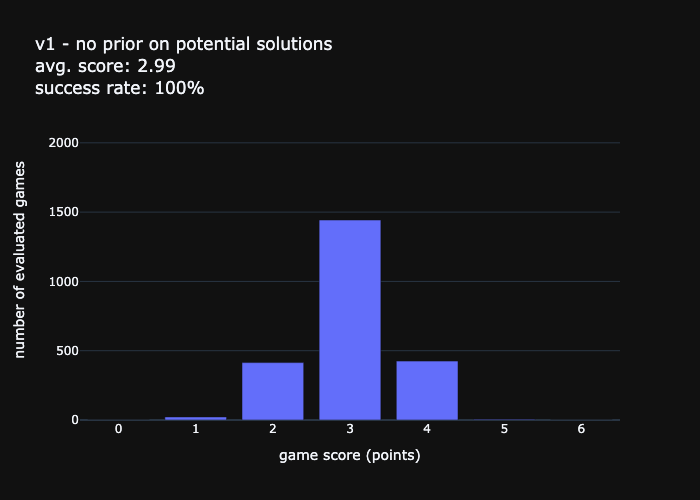
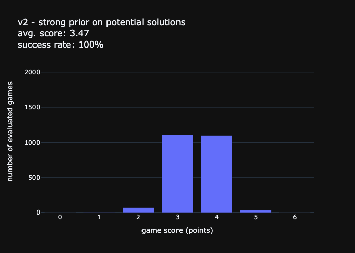
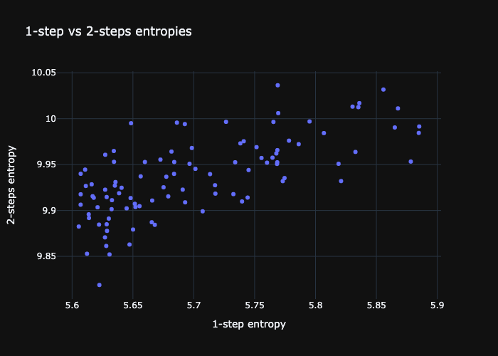

# wordle solver
## Motivation
* build an agent that can play Wordle, with the goal to maximize its score on a given evaluation set.
## Method and Results

### Heuristic
* the $entropy=\sum p * log_2(1 / p)$ measures the expected information gain from a given guess word, i.e. how much that guess is expected to reduce the number of possible solutions on average (in other words, the weighted average of all possible outcomes)
* v1: considers a list of 13k words without factoring in prior knowledge about the actual set of possible solutions (all 13k words are equally considered possible)
* v2: list of actual possible solutions (2.9k words) is used as prior.
* v3: same as v2, but entropy is calculated over 2 steps (expected information gain given best next guess following original one and guess outcome)
    * the best $guess_1$ must maximize  $E[I_1 | guess_1] + E[I_2 | guess_1]$ where:
    * $E[I_1 | guess_1]$ is the entropy (aka expected information gain) based on looking at outcomes after first guess
    * $E[I_2 | guess_1] = \sum p(outcome) * max E[I_2 | outcome]$, represents the expected information gain from selecting the best next guess $guess_2$, given the outcome of $guess_1$.

### Results
| v1 - 13k possible solutions | v2 - 2.9k possible solutions | v3: v2 with 2-steps look-ahead |
|:---|:---:|---:|
| | |  |

Theoretical best average score has been estimated to *3.58* (cf. [3blue1brown](https://www.3blue1brown.com/lessons/wordle)).
v1 and v2 performance is on par with 3blue1brown.
As for v3, the current implementation does not seem to deliver the full value (which should be fairly close to theoretical best).
Although 2-step entropies for top first guesses align well with results discussed in 3blue1brown, the avg score remains essentially flat vs v2 and is much more computationally expensive. further investigation of the `TwoStepPlayer.make_next_guess` implementation would be necessary.

### Comparing v2 vs v3: 1-Step vs 2-steps entropies
2-step entropy leads to a reshuffling of top starting words, even though 1-step entropy remains a strong predictor of 2 step entropy.
`slane` becomes the top starting guess according to that new heuristic. (`soare` is the best starting word when you only consider single step and use prior information about actual list of possible solutions).

## How to Install
`conda create -f environment.yml`  
`pip install -e .`

## More Resources
* main source of insipiration for this body of work: https://www.3blue1brown.com/lessons/wordle
* related to above: https://jonathanolson.net/experiments/optimal-wordle-solutions 

## About

